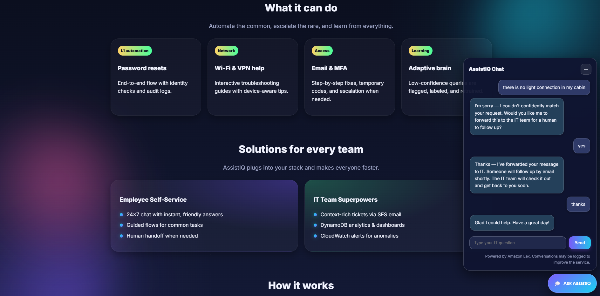
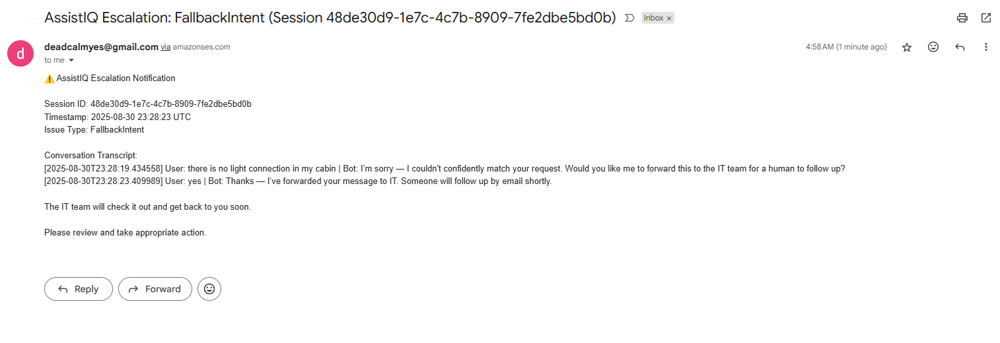
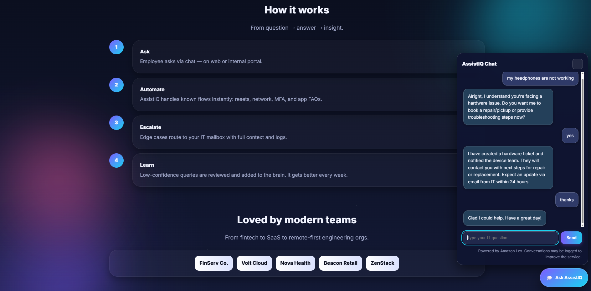
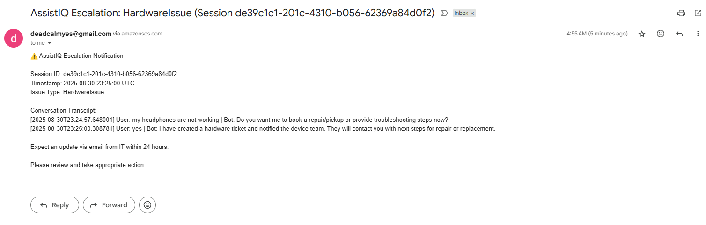
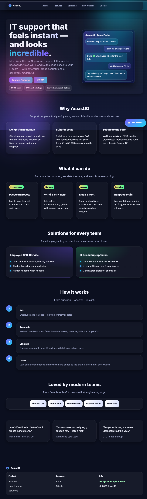

# AssistIQ – AWS-Powered IT Helpdesk Bot (Lex V2)
[](https://aws.amazon.com/lambda/) [](https://aws.amazon.com/lex/) [](https://aws.amazon.com/dynamodb/) [](https://aws.amazon.com/ses/) [](https://github.com/nishith-geedh/AssistIQ) [](https://github.com/nishith-geedh/AssistIQ/graphs/contributors) [](LICENSE) [](https://github.com/nishith-geedh/AssistIQ/commits/main)

---

AssistIQ is an **AI-driven IT helpdesk assistant** powered by **Amazon Lex V2, AWS Lambda, DynamoDB, and SES**.  
It responds to employee IT issues, maintains chat logs, and automatically escalates tickets with **full conversation transcripts** via email.

---

## ✨ Features  

- 🤖 **Conversational IT Assistant** using **Amazon Lex**  
- 📊 **Intent Fulfillment** powered by **DynamoDB knowledge base**  
- 💾 **Session Management** to track ongoing conversations  
- 📧 **Escalation Emails** via **Amazon SES**, including:  
  - Session ID  
  - Timestamp  
  - Issue Type  
  - Full Conversation Transcript  
- 🔄 **Fallback Handling** with automatic escalation  
- 🎨 **Modern Website UI** (dark, glass‑morphism inspired design)  
- 🌐 **Serverless Deployment** – scales automatically with demand  

---

## 📂 Project Structure  

```bash
AssistIQ/
│
├── .aws-sam/
│   └── build/
│       ├── ChatProxyFunction/
│       ├── ChatRoute/
│       ├── FulfillmentFunction/
│       └── template.yaml
│
├── backend/
│   └── functions/
│       ├── chat_proxy/
│       │   ├── app.py
│       │   └── requirements.txt
│       └── fulfillment/
│           ├── app.py
│           └── requirements.txt
│
├── demo/
│
├── frontend/
│   └── assets/
│       ├── app.js
│       ├── app.js.bak
│       ├── logo.svg
│       ├── style.css
│       └── index.html
│
├── scripts/
│   ├── deploy.sh
│   ├── intents.json
│   ├── lex_import_intents.json
│   ├── seed_faq.json
│   ├── seed_faq.py
│   ├── seed_intents.py
│
├── key.json
├── log.b64
├── log.txt
├── payload.json
├── README.md
├── sam-template.yaml
└── samconfig.toml

```

---

## 🚀 Quick Start  

### 0️⃣ Prerequisites

- AWS account + IAM user/role with admin (or equivalent) for setup.
- Region: choose one where **Lex V2** and **SES** are available (e.g., `us-east-1`).
- Tools:
  - AWS CLI configured: `aws configure` 
  - AWS SAM CLI
  - Python 3.10+ (for local seeding script)

## Configure SES (email escalation)

1. In **SES → Identities**, verify:
   - `SourceEmail` (sender) e.g., `assistiq@yourdomain.com`
   - `SupportEmail` (destination IT inbox) e.g., `it@yourdomain.com`

2. If your SES account is in **Sandbox**, open a support case to move to **Production** (so you can email unverified addresses).

## Create the Lex V2 bot

- **Name**: `AssistIQSupportBot`
- **Locale**: `en_US`
- **Intents**: `PasswordReset`, `WifiIssue`, `EmailAccess`, and a `Fallback`.
- **Fulfillment**: Lambda → `AssistIQ-Fulfillment` (SAM will create it; wire after deploy).
- After building and creating an **Alias**, note its **BotId** and **BotAliasId**.


### 1️⃣ Backend Deployment (AWS SAM)  

```bash
cd backend
sam build
sam deploy --guided  
# parameters:
# ProjectName: AssistIQ
# SourceEmail: VERIFIED_SENDER@domain
# SupportEmail: IT_INBOX@domain
# BotId: <copy from Lex console>
# BotAliasId: <copy from Lex console>
# BotLocaleId: en_US
# WebsiteBucketName: (leave empty to autogenerate)
```
(or)

```bash
sam build --template-file sam-template.yaml 
sam deploy --guided --template-file sam-template.yaml 
```
Outputs include:
- `ApiEndpoint` → paste into front‑end config.
- `WebsiteBucketName` → where the site will be hosted.

Resources created on first deploy:  

- DynamoDB tables: `Logs`, `FAQ`, `Sessions`  
- Lambda function for Lex fulfillment  
- IAM roles & permissions  
- SES configuration (verify `SOURCE_EMAIL`)  

### 2️⃣ Frontend Setup  

```bash
cd frontend
npm install
npm run dev
```

## Publish the website

```bash
aws s3 sync frontend/ s3://assistiq-website --delete 
```

For production:  

```bash
npm run build
npm start
```

Open the site URL shown by S3 Static Website hosting (or front with CloudFront later).

## Seed the FAQ table (optional demo content)
```bash
python3 scripts/seed_faq.py $(aws cloudformation describe-stacks --stack-name AssistIQ   --query "Stacks[0].Outputs[?OutputKey=='FAQTableName'].OutputValue" --output text)
```

## Wire Lex → Fulfillment Lambda
In **Lex console → your bot → intents → fulfillment** set the Lambda to **AssistIQ-Fulfillment** (created by SAM). Build the bot and redeploy the alias.


---

## Monitoring & Feedback
- **CloudWatch Logs** for both Lambdas.
- **ChatLogs** table records: query, (optional) NLU confidence, intent, sessionId, and timestamp.
- Weekly review logs → add new utterances/FAQs.

## Security
- IAM least‑privilege policies scoped to DynamoDB tables and SES send.
- Public API for demo; for intranet, put HTTP API behind a WAF/Cognito authorizer and host site privately.
- HTTPS: front with CloudFront + ACM cert for production.

---

## Common issues & fixes
- **SES Sandbox** → Only verified recipients work. Move to production via AWS Support.
- **Lex permissions from bot to Lambda** → Attach the proper execution role when configuring fulfillment.
- **CORS** → The HTTP API enables CORS; if you front with a different domain, adjust `AllowOrigins`.
- **Lex Runtime AccessDenied in ChatProxy** → Verify the ChatProxy role has `lex:RecognizeText`.
- **No answer for valid FAQ** → Add keywords in `scripts/seed_faq.json` or enhance matching.
- **Region mismatch** → Keep all resources in the same region; set AWS CLI default to that region.

---


## 🔑 Environment Variables  

Lambda requires the following environment variables:  

```env
LOGS_TABLE_NAME=AssistIQ_Logs
FAQ_TABLE_NAME=AssistIQ_FAQ
SESSION_TABLE_NAME=AssistIQ_Sessions
SOURCE_EMAIL=verified-sender@example.com
SUPPORT_EMAIL=it-team@example.com
```

> Both `SOURCE_EMAIL` and `SUPPORT_EMAIL` must be verified in **Amazon SES Sandbox mode**.  

---

## 🧠 Intent Workflow  

- User says: `wifi issue`  
- **Amazon Lex** matches intent → Lambda fetches fulfillment response from DynamoDB  
- **Bot asks for confirmation**  
- If **confirmed** → Logs interaction, sends escalation email with transcript  
- If **fallback** → Escalates automatically with entire conversation  


---

## 🏗️ Architecture Diagram  

### ASCII  

<pre>
User ─► Website UI ─► Amazon Lex ─► AWS Lambda (app.py)
                                │
                                ▼
                       DynamoDB (Logs, FAQ, Sessions)
                                │
                                ▼
                           Amazon SES (Escalation Emails)
</pre>

---
### Visual


The AssistIQ architecture is a robust, AWS-native solution that meticulously separates every concern for security, maintainability, and operational excellence. Here is a deep-dive technical explanation of each architecture tier, mapping components precisely from the diagram and your implementation.
________________________________________
User / Presentation Tier
•	End User interacts with a modern, glass-morphism web UI, loaded directly from an Amazon S3 bucket. This provides high availability, performance, and a globally distributed interface. All assets—including HTML, JS (the floating chat FAB/widget), CSS, and brand images—are served static from S3 with public access enabled, and responsive design for any device.
•	Website (S3 Static Hosting):
•	No backend code is exposed to users.
•	All user interaction with AssistIQ begins from here, guaranteeing rapid page loads and nearly zero downtime.
________________________________________
API Layer
•	API Gateway acts as the secure front-door for the entire backend.
•	Terminates TLS, enforces CORS, and publishes a single /chat POST endpoint.
•	Automatically scales with traffic and protects against malformed requests or attacks.
•	Only invokes trusted Lambda functions, never exposing backend internals or credentials.
________________________________________
Orchestration Layer
•	ChatProxy Lambda (and ChatRoute Lambda, same codebase) serves as the orchestrator for all chat operations:
•	Handles raw HTTP requests from API Gateway, parses input and headers, manages persistent session IDs, and applies CORS policies.
•	Logs every conversation turn in DynamoDB, providing a full chat transcript for each unique session.
•	Routes valid chat messages to Lex, preserving user identity and session context for stateful dialogue.
•	Returns bot responses (and full chat history) as neat JSON for instantaneous frontend display.
•	Ensures fault-tolerance: supports CORS preflight, status codes, and robust error handling.
________________________________________
AI / Chatbot Layer
•	Amazon Lex V2 provides state-of-the-art NLU:
•	Recognizes fine-grained IT support intents (e.g., password reset, Wi-Fi, VPN, email, hardware, fallback).
•	Handles slot extraction, confirmation flows, and fallback detection, per your imported Lex training set and scripts.
•	Seamlessly integrates with Lambda for fulfillment, sending context-rich events downstream for every intent.
________________________________________
Fulfillment & Backend Logic
•	Fulfillment Lambda is where custom business logic executes:
•	Connects to DynamoDB tables:
•	FAQ Table: Stores per-intent config, sample utterances, fulfillment text, closing messages (from your JSON-based seeds).
•	ChatLogs Table: Saves every question, bot reply, confidence score, and session/thread context for analytics and auditing.
•	Session State Table: Maintains dialog context for multi-turn flows, slot-filling, and legacy confirmation states.
•	Implements intent-specific confirmation, fulfillment, and closing logic, returning rich, user-friendly bot messages.
•	When faced with low-confidence, unknown, or fallback queries, compiles a full transcript and sends escalation emails using Amazon SES, complete with session metadata and chat history attached.
•	Ensures IT support can review all details without context loss; automates Tier 2 handoff.
•	Fault-tolerance: logs escalation success or failure, responds to user accordingly.
________________________________________
Security
•	IAM Roles & Policies
•	Each Lambda function uses least-privilege roles to access only the necessary DynamoDB tables, Lex, and SES actions.
•	No AWS service is over-permissioned; separation of roles prevents lateral access and privilege escalation.
•	VPC / PrivateLink Option
•	All core resources (Lambda, DynamoDB, API Gateway) can be VPC-bound or behind PrivateLinks for internal-only access.
•	S3 bucket public access is tightly controlled for static asset delivery, never for backend data.
•	Audit Logging
•	Every interaction—successful or failed—is logged for future review, compliance, and retraining.
________________________________________
Analytics & Retraining
•	Intent Analytics:
•	ChatLogs DynamoDB table enables powerful querying for bot performance statistics, fallback frequency, and session analysis.
•	All low-confidence or fallback queries are flagged, so IT admins can label, retrain, and expand the bot’s brain.
•	Batch export of historic logs supports Lex V2 retraining and FAQ table enrichment without loss of metadata.
•	Continuous Improvement:
•	Fallback and escalated conversations are automatically harvested for expansion of Lex’s utterance base or FAQ answers.
•	Bot confidence scores and user feedback enable targeted updates to intents and flows (no manual log scraping required).
________________________________________
This architecture ensures AssistIQ is serverless, auditable, modular, and instantly scalable—from 10 users to 10,000+. Each AWS service is isolated but deeply integrated, guaranteeing security, maintainability, and delightful UX at every touchpoint


---

## 📸 Screenshots  

### 🖥️ Website – Fallback Intent  
  

### 📧 Fallback Email  
  

### 🖥️ Website – Hardware Issue  
  

### 📧 Hardware Issue Email  
  

### 🌐 Full Website UI  
  

---

## 📈 Cost & Scalability  

| Service     | Purpose                   | Pricing                | Scalability         |
|-------------|---------------------------|------------------------|---------------------|
| DynamoDB    | Chat logs & intent store  | On-demand per request  | Auto-scaled         |
| Lambda      | Fulfillment logic         | Pay per invocation     | Scales-to-zero      |
| Amazon Lex  | Conversational AI         | Per request            | Auto-scaled         |
| Amazon SES  | Escalation emails         | Pay per email sent     | Global delivery     |
| S3          | Hosting static frontend   | Pay per GB stored      | Global delivery     |

---

## 🔄 Sample Conversation Flow  

```text
User: hi
Bot: Hello! How can I assist you today?

User: wifi issue
Bot: Okay, let me help you with your wifi issue. Do you want me to proceed?

User: yes
Bot: Are you having issues connecting to Wi-Fi?

User: yes
Bot: Try toggling Wi-Fi, reconnect to 'CorpNet'. If not fixed, do you want me to create an IT ticket?

User: yes
Bot: ✅ IT ticket created. The IT team will contact you. Transcript has been sent to IT.
```

---

## 🤝 Contributing  

Contributions, ideas, and improvements are welcome!  
Open an issue or submit a PR for features, bug fixes, or documentation.  

---

## 📜 License  

MIT License. See [LICENSE](LICENSE).  

---

**AssistIQ** delivers a modern, intelligent IT helpdesk bot —  
designed for scalability, automation, and seamless IT support.  
